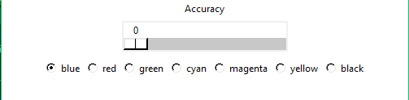
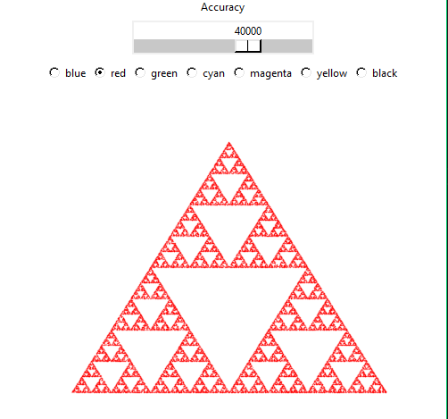

# Sierpinsi Triangle

Треугольник Серпинского — фрактал, один из двумерных аналогов множества Кантора, математическое описание которого опубликовал польский математик Вацлав Серпинский в 1915 году[1]. Также известен как «салфетка» Серпинского.

## Запуск

### Создание виртуального окружения
    python -m venv venv

### Установка необходимых библиотек
    pip install -r requirements.txt

### Запуск
    python main.py

## Сборка исполняемого файла
    python setup.py build
